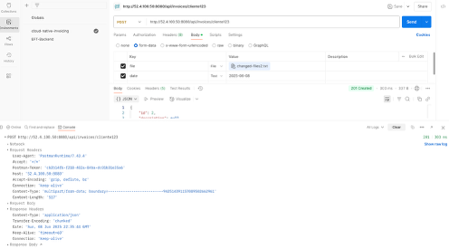

# Invoice Management Microservices

A professional, cloud-native microservices solution for invoice management, built with Spring Boot, Docker, AWS S3, EFS, and **RabbitMQ message queues**. Developed by Rodrigo Sanchez ([sanchezdev.com](https://sanchezdev.com)).

**Version 3.0** - Updated with RabbitMQ integration for message queues and Oracle Cloud database integration.

---

## Table of Contents
- [Overview](#overview)
- [Architecture](#architecture)
- [Features](#features)
- [Tech Stack](#tech-stack)
- [RabbitMQ Integration](#rabbitmq-integration)
- [Screenshots](#screenshots)
- [Setup & Deployment](#setup--deployment)
- [Environment Variables](#environment-variables)
- [API Documentation](#api-documentation)
- [CRUD Testing](#crud-testing)
- [License](#license)

---

## Overview
This project provides a robust backend for managing invoices, supporting file uploads to AWS S3, persistent storage on AWS EFS, and **asynchronous message processing with RabbitMQ**. It includes automatic boleta processing and storage in Oracle Cloud database.

## Architecture
- **invoice-service**: Handles invoice CRUD operations, orchestrates file storage, and **sends messages to RabbitMQ queue**
- **file-service**: Manages file uploads/downloads to AWS S3 and EFS
- **rabbitmq-service**: **NEW** - Processes RabbitMQ messages and stores boletas in Oracle Cloud
- **RabbitMQ Server**: Message broker for asynchronous processing
- **AWS S3**: Stores invoice files securely
- **AWS EFS**: Provides persistent file storage for local access
- **Oracle Cloud**: Stores processed boletas from message queue
- **Docker**: Containerizes all services for easy deployment

## Features
- RESTful API for invoice management
- File upload, download, update, delete, and listing
- **🆕 RabbitMQ message queues for boleta processing**
- **🆕 Automatic Oracle Cloud database integration**
- **🆕 Asynchronous message processing with consumer endpoints**
- AWS S3 and EFS integration
- Dockerized microservices
- Secure handling of AWS credentials (supports temporary session tokens)
- Azure AD B2C authentication with role-based access control
- Ready for CI/CD with GitHub Actions

## Tech Stack
- Java 17, Spring Boot 3
- Spring Data JPA, Lombok
- **🆕 Spring AMQP (RabbitMQ)**
- **🆕 Oracle Database (Cloud)**
- AWS SDK v2 (S3)
- Docker & Docker Compose
- AWS S3, AWS EFS
- H2 (in-memory, can be replaced with RDS)

## RabbitMQ Integration

### 🐰 Message Flow
1. **Invoice Creation** → Automatic message sent to RabbitMQ queue
2. **RabbitMQ Consumer** → Processes messages and stores in Oracle Cloud
3. **REST APIs** → Query processed boletas from Oracle database

### 📡 Key Endpoints
- `POST /api/rabbitmq/send-message` - Send message to queue
- `GET /api/rabbitmq/boletas` - List all processed boletas
- `GET /api/rabbitmq/boletas/client/{clientId}` - Get boletas by client
- `GET /api/rabbitmq/boletas/invoice/{id}` - Get boletas by invoice ID

**📖 For detailed RabbitMQ documentation, see [RABBITMQ-README.md](RABBITMQ-README.md)**

## Screenshots

- 
- 
- 
- 

## Setup & Deployment

### 1. Build Docker Images
```sh
docker build -t sanchezdev01/file-service:latest -f Dockerfile.file .
docker build -t sanchezdev01/invoice-service:latest -f Dockerfile.invoice .
docker build -t sanchezdev01/rabbitmq-service:latest -f Dockerfile.rabbitmq .
```

### 2. Stop and Remove Old Containers
```sh
docker stop file-service && docker rm file-service
docker stop invoice-service && docker rm invoice-service
docker stop rabbitmq-service && docker rm rabbitmq-service
```

### 3. Run Containers with AWS Credentials
```sh
docker run -d --restart unless-stopped \
  --name file-service \
  -p 8081:8081 \
  -e AWS_ACCESS_KEY_ID="<your-access-key>" \
  -e AWS_SECRET_ACCESS_KEY="<your-secret-key>" \
  -e AWS_SESSION_TOKEN="<your-session-token>" \
  -e AWS_REGION="us-east-1" \
  -v /mnt/efs/invoices:/mnt/efs/invoices \
  sanchezdev01/file-service:latest

docker run -d --restart unless-stopped \
  --name invoice-service \
  -p 8080:8080 \
  -e AWS_ACCESS_KEY_ID="<your-access-key>" \
  -e AWS_SECRET_ACCESS_KEY="<your-secret-key>" \
  -e AWS_SESSION_TOKEN="<your-session-token>" \
  -e AWS_REGION="us-east-1" \
  sanchezdev01/invoice-service:latest

docker run -d --restart unless-stopped \
  --name rabbitmq-service \
  -p 5672:5672 -p 15672:15672 \
  sanchezdev01/rabbitmq-service:latest
```

> _Replace `<your-access-key>`, `<your-secret-key>`, and `<your-session-token>` with your actual AWS credentials._

### 4. (Optional) CI/CD with GitHub Actions
- On push, GitHub Actions can build and push images, then you can redeploy using the above Docker commands.

## Environment Variables
- `AWS_ACCESS_KEY_ID`, `AWS_SECRET_ACCESS_KEY`, `AWS_SESSION_TOKEN`, `AWS_REGION`: Required for AWS S3/EFS access.
- `file.service.url`: URL of the file-service (used by invoice-service).

## API Documentation

### Invoice Service Endpoints
- `POST   /api/invoices/{clientId}`: Create invoice (multipart: file, date)
- `GET    /api/invoices`: List all invoices
- `GET    /api/invoices/history/{clientId}`: List invoices by client
- `GET    /api/invoices/{id}`: Get invoice by ID
- `PUT    /api/invoices/{id}`: Update invoice
- `DELETE /api/invoices/{id}`: Delete invoice
- `GET    /api/invoices/download/{id}`: Download invoice file

### File Service Endpoints
- `POST   /api/files/upload`: Upload file to S3/EFS
- `GET    /api/files/download/{key}`: Download file from S3
- `DELETE /api/files/delete/{key}`: Delete file from S3
- `GET    /api/files/list`: List all files

### RabbitMQ Service Endpoints
- `POST   /api/rabbitmq/send-message`: Send message to RabbitMQ queue
- `GET    /api/rabbitmq/boletas`: List all processed boletas
- `GET    /api/rabbitmq/boletas/client/{clientId}`: Get boletas by client
- `GET    /api/rabbitmq/boletas/invoice/{id}`: Get boletas by invoice ID

## CRUD Testing
- All endpoints can be tested via Postman or curl.
- Example curl for upload:
  ```sh
  curl -X POST "http://localhost:8080/api/invoices/cliente123" \
    -F "file=@archivo-prueba.txt" \
    -F "date=2025-06-08"
  ```
- Example curl for download:
  ```sh
  curl -O -J "http://localhost:8080/api/invoices/download/1"
  ```
- See screenshots for Postman examples.

## License
This project is licensed under the MIT License. See [LICENSE](LICENSE).

---

**Author:** Rodrigo Sanchez  
[https://sanchezdev.com](https://sanchezdev.com)
[https://linkedin.com/in/sanchezdev/](https://linkedin.com/in/sanchezdev/)

